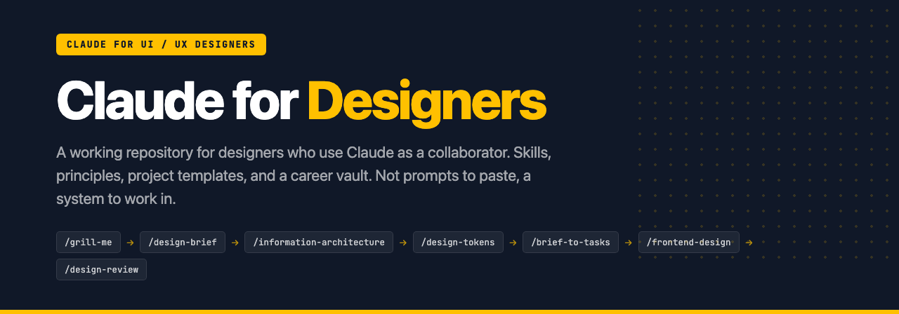
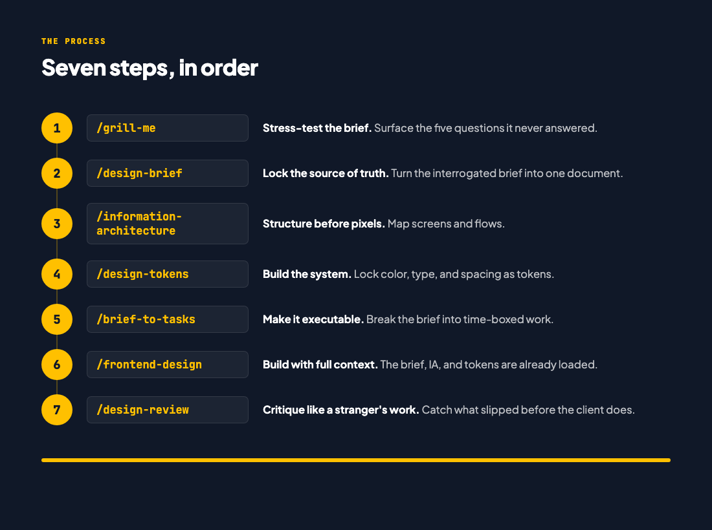

<p align="center">
  
  
  
  
  
</p>

# Claude for Designers

A working repository for designers who use Claude as a collaborator. Skills, principles, project templates, and a career vault. Not a pile of prompts to paste, a system to work inside.

## Read this before you start

- **This is not a beginner UX course.** It assumes you already know UX fundamentals: research, flows, hierarchy, critique. What it teaches is how to get your Claude setup right so you direct AI instead of operating Figma.
- **What it costs.** Claude Pro, about $20 a month, plus the free Claude Desktop app. That is the honest number. There is no free path that does what this course needs.
- **Your account must be your own.** Never share a login, never buy a seat in someone else's account, never split one subscription between friends. Shared accounts get flagged by IP and held, and you lose access mid-course. Two students learned this the hard way last batch.

## Where to start

Download the folder, open it in Claude Code, and type:

```
explain this folder to me
```

Claude reads [`CLAUDE.md`](CLAUDE.md), works out which class you are on by looking at which files are still blank, and tells you which file is today's. That is the fastest orientation available. Do it before reading the rest of this page.

## Why this exists

Claude with no context produces work any agency in any city could ship with the same prompt. That is the commodity end of design, and it is the part AI is eating fastest.

The designers who stay valuable bring what Claude structurally cannot: a real brief, a real user, a real market, and the judgment to push back. This repo is the scaffolding for that. It makes the context permanent so you stop re-briefing Claude every conversation, and it keeps the decisions yours.

## How the folder grows

You do not get a finished workspace. You build it one file at a time. Each class: open one file, learn why it exists, fill it in for your own project, bring it back.

| # | Class | The file you fill in |
|---|---|---|
| 1 | What Claude Is and Why This Matters Now | `principles/context-block.md` (you fill it in, for your own market) |
| 2 | The Working Agreement | `principles/claude-contract.md` and `projects/edubridge/claude-contract.md` |
| 3 | The New Brief | `projects/edubridge/brief-v3-interrogated.md` |
| 4 | Claude as Critic | `projects/edubridge/critique-notes.md` |
| 5 | Figma as Source of Truth | `projects/edubridge/tokens.md` |
| 6 | Claude Code and Building One Real Flow | `projects/edubridge/my-booking-screen.html` |
| 7 | How to Sell Yourself: Brand and Portfolio | `career-vault/01-positioning.md`, `02-portfolio-story.md` |
| 8 | How to Sell Yourself: The Interview | `career-vault/03-resume.md`, `04-interview-answers.md`, `05-linkedin-content.md` |

Every file you fill in carries the same shape: what it is for, why Claude needs it, a filled EduBridge example, then a `## YOUR TURN` section you answer in place. When you are done, delete the scaffolding above `YOUR TURN`. What is left is your real working file.

The repo you downloaded contains the finished version of everything. That is the answer key, not this week's homework. Only touch the current week's file.

## Two rules about where files go

1. **Root versus project.** Root holds what is true about *you*: how you work, your taste, your voice, your skills. A project folder holds what is true about *that client*: their brief, their users, their constraints. Test: if it would still be true on your next job, it goes at root.
2. **Select a Folder is a decision.** Open Claude Code at the **root** when the work spans projects (writing your contract, building a skill). Open at the **project folder** when you are doing client work. Opening at the wrong level is how you get generic output, or one client's context leaking into another's.

## The nine-step process



Run them in order on any project. Skip a step and the next one does that step's work badly.

## What's in here

```
claude-for-designers/
├── CLAUDE.md              what Claude reads when you open this folder
├── principles/            the knowledge layer: how you work
│   ├── claude-contract.md     your working contract with Claude
│   ├── design-taste.md        taste principles for designers using AI
│   ├── anti-ai-slop.md        patterns to refuse to ship
│   └── context-block.md       your default user and market, in six lines
├── skills/                the capability layer: the nine commands
├── projects/              where work happens, one folder per project
│   └── edubridge/             the worked example, brief through built screen
└── career-vault/          positioning, portfolio stories, interview prep
```

`principles/` is the part most people skip and the part that makes the difference. Claude reads it before it does anything, so the first draft already sounds like your work instead of everyone's.

## Install

**Getting the repo.** The green Code button on GitHub gives you a ZIP: download and unzip it, no Git needed. Or clone it if you know Git. The contents are identical. The unzipped folder may be named `claude-for-designers-main`, which is fine.

**Model settings.** Sonnet 5 at medium effort, for everything in this course. Do not spend your session budget on a bigger model.

**Turning the nine skills into slash commands.** You need this from Class 2, which is the first class that runs one (`/grill-me`). Open a terminal in your unzipped or cloned folder and run:

```bash
mkdir -p ~/.claude/skills
for f in grill-me design-brief information-architecture design-tokens brief-to-tasks frontend-design design-review heuristic-evaluation persona-acid-test; do
  mkdir -p ~/.claude/skills/$f
  cp skills/$f.md ~/.claude/skills/$f/SKILL.md
done
```

Restart Claude Code, type `/`, and the nine commands appear. If the terminal is unfamiliar, that is normal; bring it to the class or the office hour rather than guessing.

## Start your own project

```bash
cp -r projects/edubridge projects/your-project
cd projects/your-project
```

Replace the brief, run `/grill-me`, and work down the nine steps. The folder is the process, not just the output of it.

## Going deeper

[**claudecodeguide.dev/for-designers**](https://claudecodeguide.dev/for-designers) has bite-sized guides for specific design workflows: brief decoding, critique gathering, research synthesis, handoff. Use it as your reference library once the skills are installed.

[**Ostad: Claude for UI/UX Designers**](https://ostad.app) is the eight-class course that walks through this workspace with EduBridge Bangladesh as the running example.

## License

MIT. Use these in your work, change them, share them. Attribution appreciated, not required.

## Built by

[Shadman Rahman](https://github.com/mshadmanrahman). Product manager, former designer. These skills came out of real design work across Bangladesh and EU clients, then got road-tested with junior designers in the Ostad course.
