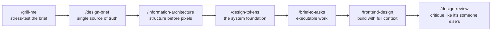

# Claude for Designers

A working repository for designers who use Claude as a collaborator. Skills, principles, project templates, and a career vault. Not a pile of prompts to paste, a system to work inside.

Most designers use Claude like a vending machine: paste a request, take whatever drops out. This repo is the opposite. You clone it, brief Claude once through a working contract, and then run a seven-step design process where every step builds on the last. The output stops being generic the moment Claude knows your project, your market, and your constraints.

Built for the [Claude for UI/UX Designers](https://ostad.app) course on Ostad, with Bangladesh-market design as the worked example. You do not need the course to use the repo.

---

## Why this exists

Claude with no context produces work any agency in any city could ship with the same prompt. That is the commodity end of design, and it is the part AI is eating fastest.

The designers who stay valuable are the ones who bring what Claude structurally cannot: a real brief, a real user, a real market, and the judgment to push back. This repo is the scaffolding for that. It makes the context permanent so you stop re-briefing Claude every conversation, and it keeps the decisions yours.

---

## The seven-step process



Run them in order on any project. Skip a step and the next one does that step's work badly.

| Step | Command | What it does |
|---|---|---|
| 1 | `/grill-me` | Stress-tests the brief before any design begins. Returns the five questions the brief never answered. |
| 2 | `/design-brief` | Turns the interrogated brief into a single source of truth. |
| 3 | `/information-architecture` | Maps screens and flows before a single pixel is drawn. |
| 4 | `/design-tokens` | Locks colors, type, and spacing as a system, not loose decisions. |
| 5 | `/brief-to-tasks` | Breaks the brief into time-boxed, executable work. |
| 6 | `/frontend-design` | Builds the interface using the brief, IA, and tokens as context. |
| 7 | `/design-review` | Critiques the output with the rigor you would apply to a stranger's work. |

---

## What's in here

```
claude-for-designers/
├── CLAUDE.md              what Claude reads when you open the project
├── principles/            the knowledge layer: how you work
│   ├── claude-contract.md     your working contract with Claude
│   ├── design-taste.md        taste principles for designers using AI
│   ├── anti-ai-slop.md        patterns to refuse to ship
│   └── bd-defaults.md         market context block (swap for your market)
├── skills/                the capability layer: the seven commands
├── projects/              where work happens, one folder per project
│   └── edubridge/             the worked example, brief through built screen
└── career-vault/          positioning, portfolio stories, interview prep
```

`principles/` is the part most people skip and the part that makes the difference. It is the working contract, the taste rules, and the anti-slop list. Claude reads it before it does anything, so its first draft already sounds like your work instead of everyone's.

---

## Install

Pick the Claude interface you use. Same files work everywhere, only the install path changes.

### Claude Code (terminal, or the Desktop App's Code tab)

```bash
git clone https://github.com/mshadmanrahman/claude-for-designers.git
cd claude-for-designers
mkdir -p ~/.claude/skills
for f in grill-me design-brief information-architecture design-tokens brief-to-tasks frontend-design design-review; do
  mkdir -p ~/.claude/skills/$f
  cp skills/$f.md ~/.claude/skills/$f/SKILL.md
done
```

Restart Claude Code, type `/`, and the seven commands appear.

### Claude Cowork (Desktop App, Cowork tab)

Open the Cowork tab, go to Settings, Plugins, Upload plugin, and point it at this repo's `skills/` folder. The seven skills become slash commands.

### Claude (Chat, on claude.ai or the Desktop App)

Settings, Projects, New Project. For each skill, paste the contents of `skills/{name}.md` into the project's custom instructions and save. Conversations inside that project follow the skill.

---

## Which Claude interface, when

- **Chat** for briefing, critique, and ideation. Lightest and fastest.
- **Cowork** when you want Claude to do the work across local files: "restructure this Figma export folder," "build a comparison deck from these screenshots."
- **Claude Code** when you are building components or HTML.
- **Claude in Chrome** for design research: have Claude walk 30 competitor flows and summarize.
- **Claude for Office** for client decks in PowerPoint, Word, Excel.

---

## Start your own project

```bash
cp -r projects/edubridge projects/your-project
cd projects/your-project
```

Replace the brief, run `/grill-me`, and work down the seven steps. The folder is the process, not just the output of it.

---

## Going deeper

[**claudecodeguide.dev/for-designers**](https://claudecodeguide.dev/for-designers) has bite-sized guides for specific design workflows: brief decoding, critique gathering, research synthesis, handoff. Use it as your reference library once the skills are installed.

[**Ostad: Claude for UI/UX Designers**](https://ostad.app) is the structured eight-class course that walks through this entire workspace with EduBridge Bangladesh as the running example.

---

## License

MIT. Use these in your work, change them, share them. Attribution appreciated, not required.

## Built by

[Shadman Rahman](https://github.com/mshadmanrahman). Product manager, former designer. These skills came out of real design work across Bangladesh and EU clients, then got road-tested with junior designers in the Ostad course.
