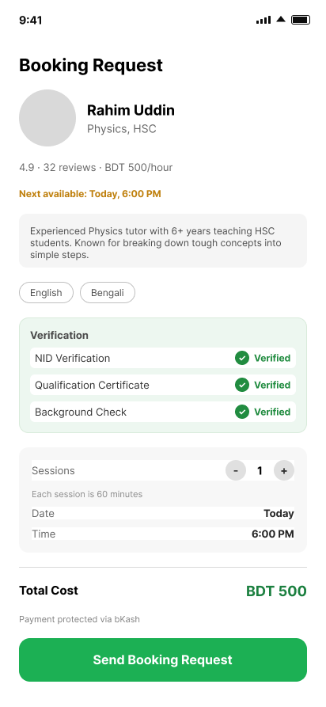
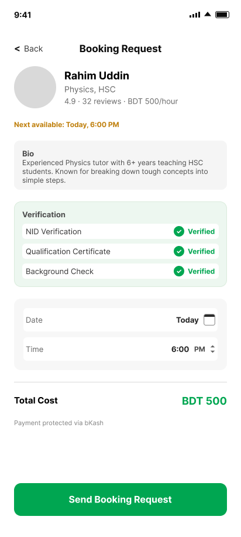
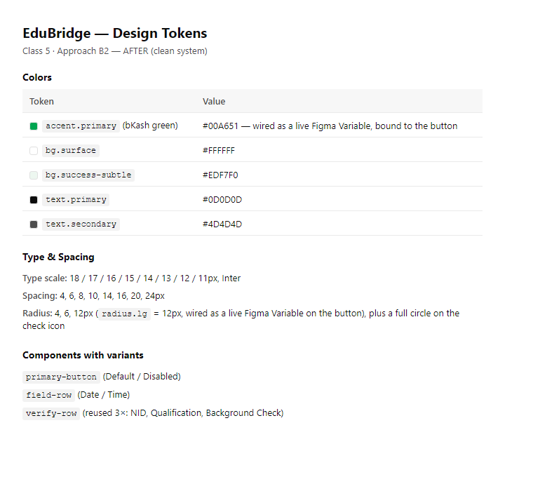

# Assignment 5 submission — everything in one place

This folder has exactly what the assignment brief asks you to post in the class channel. Nothing else to hunt for.

## 1. Link to the cleaned file

Figma: https://www.figma.com/design/UKrHagmQWWdBAWUH0geIr3/Edubridge?node-id=5-3

Frame: **Approach B2 — AFTER (clean system)**

## 2. Before / after screenshots

| Before | After |
|---|---|
|  |  |

What changed: layer names went from unnamed (`Frame`, `Frame`...) to readable (`status-bar`, `tutor-summary`, `verification-card`...), and the session-quantity stepper was removed — the logic error flagged in [../critique-notes.md](../critique-notes.md) (asking how many sessions before the tutor even accepts the booking).

## 3. Token set

Full version with notes on what's wired vs. not: [../tokens.md](../tokens.md)

Image version for the post (Ostad only takes images + links, not `.md` files): `token-summary.png`

---

## Submit this on Ostad

Ostad only accepts images and links — no file/markdown attachments. Submit exactly these three things:

1. **Link:** the Figma link above
2. **Image:** `before.png` + `after.png`
3. **Image:** `token-summary.png`
