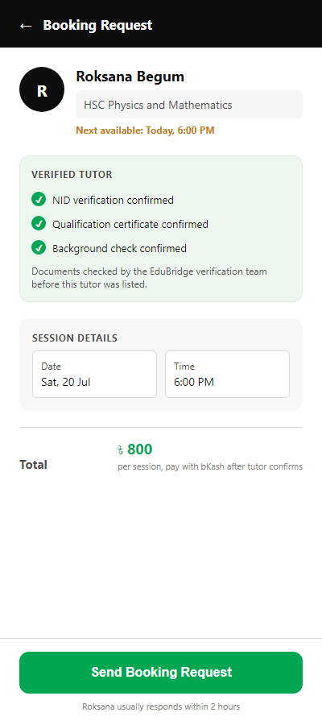
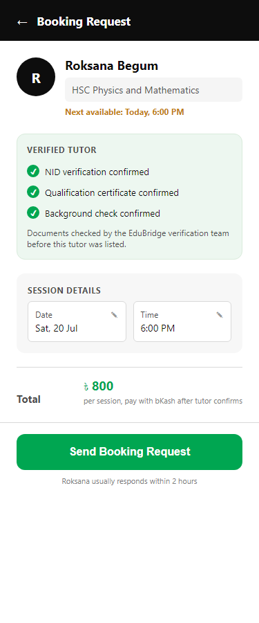

# Assignment 6 submission — everything in one place

## 1. The file

[../booking-screen.html](../booking-screen.html) — built from `brief-v3-interrogated.md` + `tokens.md`, not the course's starter demo file.

## 2. Before / after

| Before | After |
|---|---|
|  |  |

## 3. Two directed fixes (reasoned, not taste)

1. **Removed the dead-space gap above the CTA.** The button was pinned to the bottom of the viewport with `margin-top: auto`, which left a large empty white gap on a screen this short — the exact problem flagged for a different approach back in Class 4 ([critique-notes.md](../critique-notes.md): "the large empty space... makes it look like the page did not load properly"). Fixed by letting the CTA sit naturally after the content instead of being force-pushed to the bottom.
2. **Added a loading/disabled state to the CTA button.** Also directly from [critique-notes.md](../critique-notes.md): "no loading state on the button, so a user on 3G may tap it twice and create duplicate requests." Tapping "Send Booking Request" now disables the button, changes the label to "Sending request…", and tells the user not to tap again.

## 4. Critique pass (`/impeccable` substitute) — one thing caught and fixed

`/impeccable` is referenced in the Class 6 slides but doesn't exist in this repo's `skills/` folder — no source link was ever found for it. Ran a Nielsen-heuristics pass instead (this repo's actual `/heuristic-evaluation` skill), which is the closest equivalent: structured, per-element, one-fix-per-finding.

**Caught:** The Date and Time fields in the schedule card ("Sat, 20 Jul" / "6:00 PM") were plain text inside a bordered box — visually identical to a static label, with no signal that they're meant to be tappable/editable. Violates *match between system and the real world* — a bordered box that looks like a form field but gives no affordance to act on it.

**Fixed:** Added a small pencil icon to each field to signal it's editable.

## 5. Checked at phone width

375×812, rendered headless — matches the screenshots above.

---

## Submit this on Ostad

1. **File:** `booking-screen.html`
2. **Images:** `before.png` + `after.png`
3. **One line:** "Critique caught a fake-looking static date/time field with no tap affordance — fixed by adding an edit icon."
